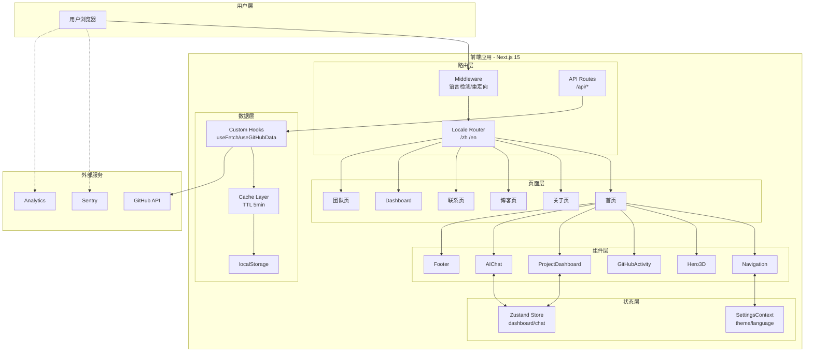
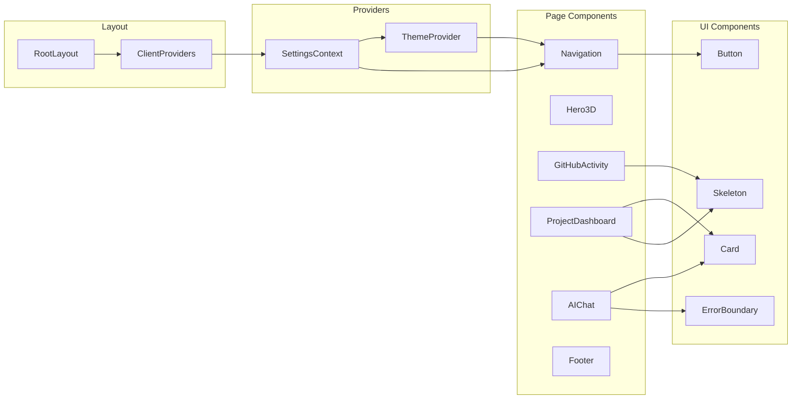
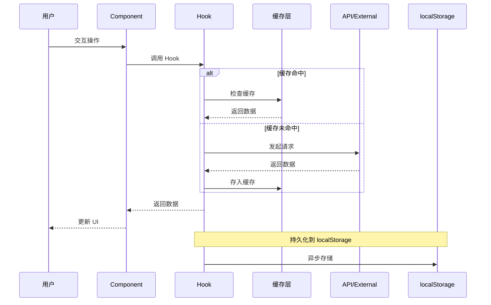
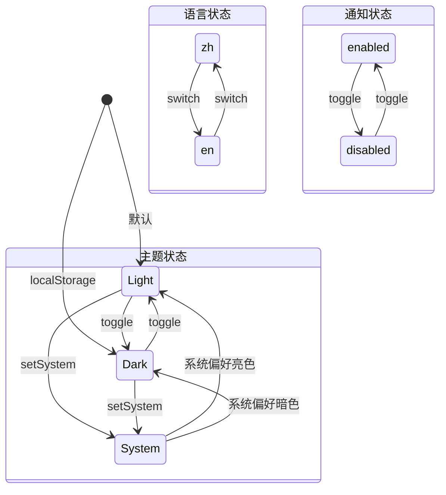
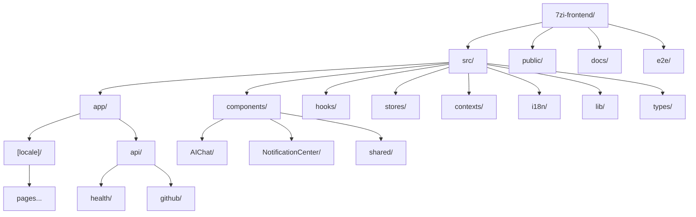
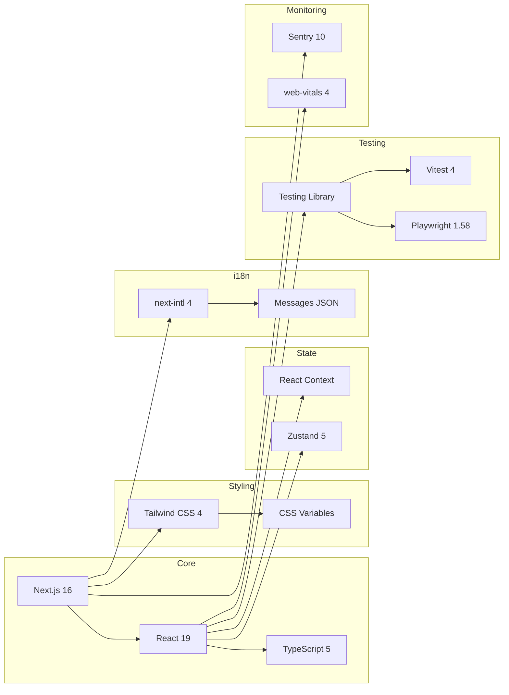

# 7zi-Frontend 架构图 (Mermaid)

## 整体架构



## 组件依赖关系



## 数据流



## 状态管理



## 部署架构

```mermaid
graph TB
    subgraph "开发环境"
        DEV[Developer Machine]
        GIT[Git Repository]
    end

    subgraph "CI/CD"
        GH Actions[GitHub Actions]
        BUILD[Build Process]
        TEST[Test Suite]
    end

    subgraph "生产环境"
        subgraph "Docker Container"
            NEXT[Next.js Server<br/>Standalone]
            NGINX[Nginx Reverse Proxy]
        end
        subgraph "Static Assets"
            CDN[CDN/Static Files]
            IMG[Optimized Images]
        end
    end

    subgraph "监控"
        SENTRY[Sentry Error Tracking]
        VITALS[Web Vitals]
    end

    DEV -->|push| GIT
    GIT -->|trigger| GH Actions
    GH Actions --> BUILD
    BUILD --> TEST
    TEST -->|pass| NGINX
    NGINX --> NEXT
    NEXT --> CDN & IMG

    NEXT -->|errors| SENTRY
    NEXT -->|metrics| VITALS
```

## 目录结构



## 技术栈关系



---

_使用 Mermaid.js 渲染 - 可在支持 Mermaid 的 Markdown 查看器中查看_
